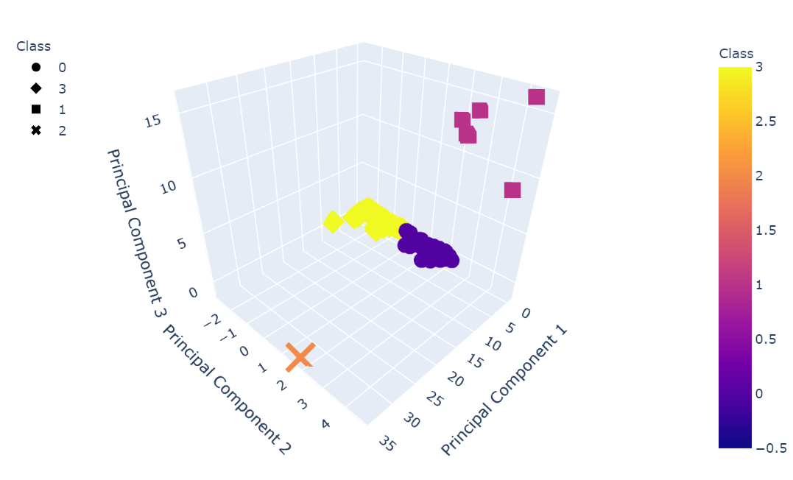

# Cryptocurrency_Unsupervised_Learning

The purpose of the analysis contained in this repository was to explore a range of different cryptocurrencies through the application of unsupervised machine learning techniques.

In particular, principal component analysis was utilized for the purposes of dimensionality reduction, followed by the implementation of k-means clustering to classify and differentiate groups of cryptocurrencies which exhibit similar characteristics. Results of this process are illustrated in the below figure (where individual cryptocurrencies have been clustered into four separate groupings labeled by "Class"):

